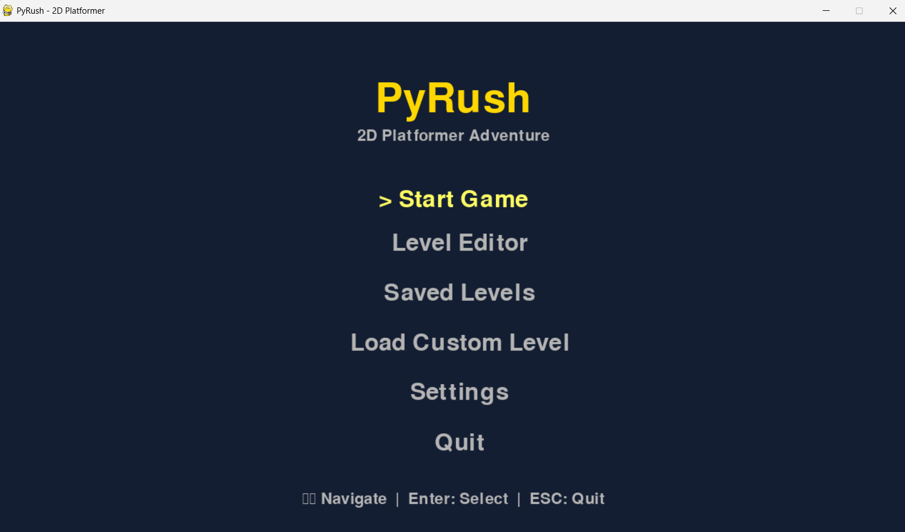
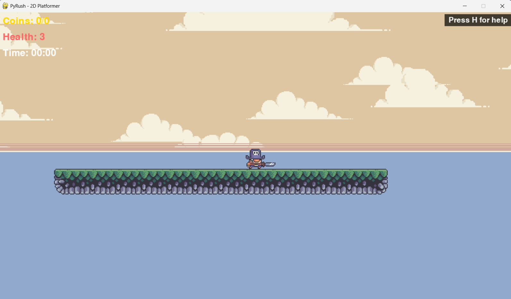
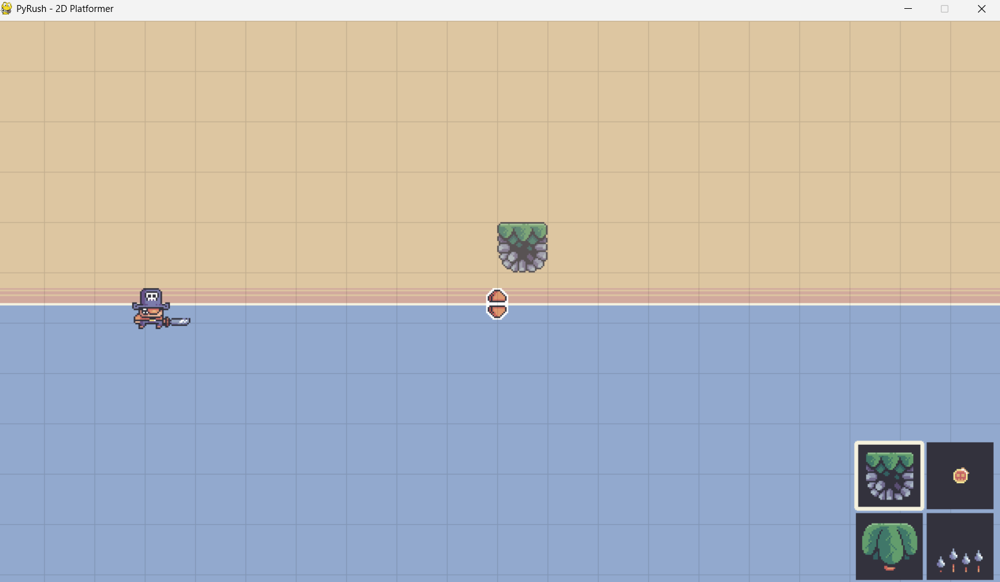
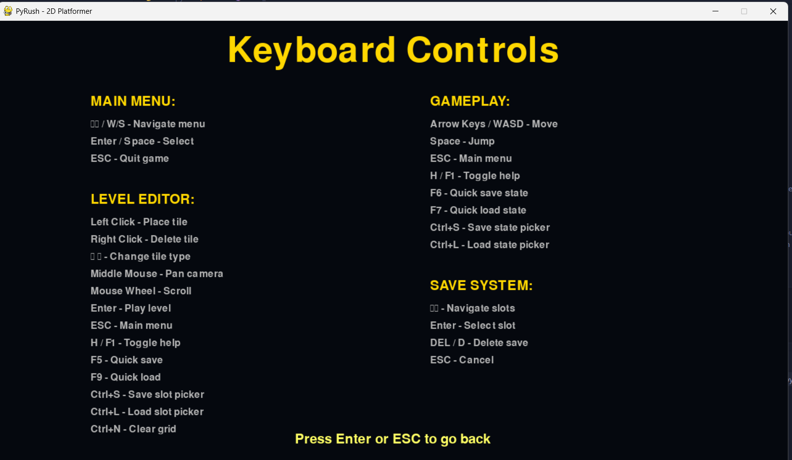

# 🎮 PyRush - 2D Platformer Game


> A feature-rich 2D platformer game with level editor, intelligent AI, and comprehensive save system built with Python and Pygame.

## 🌟 Project Overview
PyRush is a complete 2D platformer game featuring custom physics, intelligent enemy AI, a full-featured level editor, and persistent save/load functionality with multiple save slots. This is an **open source project** - anyone can contribute, modify, and improve the codebase!

## 📸 Screenshots

### 🏠 Main Menu


### 🎮 Gameplay


### 🛠️ Level Editor


### ⌨️ Controls


## ✨ Key Features

### 🎮 Core Gameplay
- **Responsive Controls**: Smooth physics-based movement with WASD/Arrow keys
- **Rich Animations**: Fully animated player, enemies, coins, and environmental objects  
- **Pixel-Perfect Collisions**: Accurate collision detection system
- **Smart Enemy AI**: Three unique enemy types with intelligent behavior patterns
- **Health System**: 3-hit health system with visual feedback and death screen
- **Interactive Elements**: Coin collection, damage mechanics, level completion tracking

### 🛠️ Advanced Level Editor
- **Intuitive Design**: Grid-based system with drag-and-drop functionality
- **Multi-Layer Support**: Terrain, water, enemies, coins, and decorative palms
- **Real-Time Preview**: See your level changes instantly as you build
- **Professional Tools**: Clear grid, object placement, and live editing capabilities

### 💾 Comprehensive Save System (3 Slots)
#### Level Editor Saves:
- **F5**: Quick save to last used slot
- **F9**: Quick load from last used slot  
- **Ctrl+S**: Save with slot picker UI
- **Ctrl+L**: Load with slot picker UI

#### Game Progress Saves:
- **F6**: Quick save game state (health, coins, time, position)
- **F7**: Quick load game state
- **Menu Options**: Full save/load interface in main menu

### 🎯 Controls
| Action | Keys |
|--------|------|
| Move | Arrow Keys / WASD |
| Jump | Space |
| Menu Navigation | Arrow Keys + Enter |
| Help | H or F1 (in-game) |
| Return to Menu | ESC |

## 🚀 Installation & Setup

### Prerequisites
- Python 3.8+ 
- Pygame 2.0+

### Quick Start
```bash
# Clone the repository
git clone https://github.com/SolarisXD/PyRush.git
cd PyRush

# Install dependencies  
pip install pygame

# Run the game
python main.py
```

## 📂 Project Structure
```
PyRush/
├── 🎮 Game Core
│   ├── main.py              # Game initialization and main loop
│   ├── level.py             # Gameplay logic and level management  
│   ├── sprites.py           # Player, enemies, and game entities
│   └── main_menu.py         # Main menu system
├── 🛠️ Level Editor
│   ├── editor.py            # Level editor implementation
│   └── menu.py              # Editor UI components
├── 💾 Save System
│   ├── save_manager.py      # Multi-slot save/load functionality
│   └── save_data/           # Auto-generated save files
├── ⚙️ Core Systems
│   ├── settings.py          # Game configuration
│   ├── support.py           # Utility functions  
│   └── timer.py             # Game timing utilities
├── 🎨 Assets
│   ├── graphics/            # Sprites and animations
│   ├── audio/               # Sound effects and music
│   └── images/              # Screenshots and promotional media
└── 📄 Documentation
    └── README.md            # This file
```

## 🤝 Contributing
This is an **open source project** and contributions are welcome! Whether you want to:
- 🐛 Fix bugs
- ✨ Add new features  
- 🎨 Improve graphics or UI
- 📚 Enhance documentation
- 🎵 Add new audio/music
- 🎮 Create new levels

Feel free to fork the repository and submit pull requests!

### How to Contribute
1. Fork the repository
2. Create your feature branch (`git checkout -b feature/AmazingFeature`)
3. Commit your changes (`git commit -m 'Add some AmazingFeature'`)
4. Push to the branch (`git push origin feature/AmazingFeature`)
5. Open a Pull Request

## 🏆 Credits & Acknowledgments

### 💻 Code Contributors
- **Original Creator**: [Clear Code](https://github.com/clear-code-projects) - Initial game framework and core mechanics
- **Enhanced by**: [SolarisXD](https://github.com/SolarisXD) - Advanced save system, UI improvements, and additional features

### 🎨 Artwork & Assets
- **Graphics**: Pixelfrog - [Treasure Hunters Asset Pack](https://pixelfrog-assets.itch.io/treasure-hunters) (CC0 License)
- **Music**: 
  - Explorer Theme: [OpenGameArt](https://opengameart.org/content/8-bit-explorer-theme)
  - SuperHero Theme: [OpenGameArt](https://opengameart.org/content/adventure-theme)

## 📄 License
This project is released under **CC0 1.0 Universal (Public Domain)**

[](https://creativecommons.org/publicdomain/zero/1.0/)

You can copy, modify, distribute and perform the work, even for commercial purposes, all without asking permission. See [LICENSE](https://creativecommons.org/publicdomain/zero/1.0/) for details.

---

<div align="center">

**⭐ If you enjoy PyRush, please give it a star! ⭐**

Made with ❤️ by the open source community

[🐛 Report Bug](../../issues) • [✨ Request Feature](../../issues) • [🤝 Contribute](../../pulls)

</div>
